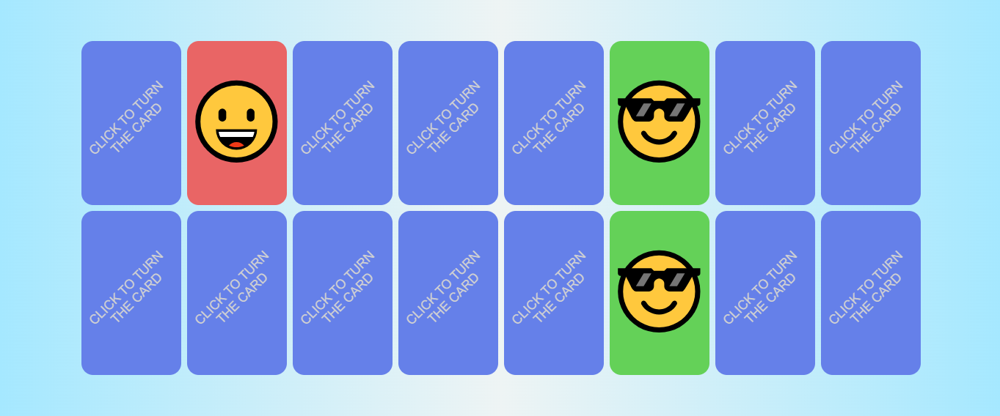

# Matching Game - README

<h1 align="center">Matching Game</h1>

  

## Table of Contents

- [Introduction](#introduction)
- [Features](#features)
- [Technologies Used](#technologies-used)
- [Getting Started](#getting-started)
- [Usage](#usage)
- [Contributing](#contributing)
- [License](#license)

## Introduction

Welcome to the Matching Game project! This is a memory-based game built using Next.js, TypeScript, React Table, and Supabase. Test and improve your memory skills by matching pairs of cards while enjoying a modern web application.

## Features

- Interactive and engaging memory gameplay.
- Customizable grid sizes to increase the difficulty.
- Score tracking to measure your performance.
- Responsive design for a seamless experience on different devices.
- Integration with Supabase for storing high scores and user data.

## Technologies Used

- [Next.js](https://nextjs.org/): A React framework for building server-rendered applications.
- [TypeScript](https://www.typescriptlang.org/): A typed superset of JavaScript that compiles to plain JavaScript.
- [React Table](https://react-table.tanstack.com/): A flexible and extensible data table library for React.
- [Supabase](https://supabase.io/): An open-source Firebase alternative that provides a backend-as-a-service platform.
- [CSS Modules](https://github.com/css-modules/css-modules): A way to locally scope CSS by automatically generating unique class names.
- [Jest](https://jestjs.io/) and [React Testing Library](https://testing-library.com/react/): For unit testing and ensuring code quality.

## Getting Started

To get the Matching Game up and running on your local machine, follow these steps:

1. Clone the repository: `git clone https://github.com/filipedealencar/matching-game.git`
2. Navigate to the project directory: `cd matching-game`
3. Install dependencies: `yarn install`
4. Copy the `.env.example` file to `.env.local` and fill in your Supabase credentials.
5. Start the development server: `yarn dev`

## Usage

- Launch the game and select a difficulty level.
- Click on cards to reveal their images.
- Try to find matching pairs by remembering the positions of the cards.
- The game ends when all pairs are successfully matched.
- Your scores will be recorded and displayed on the high scores leaderboard.

---

Have fun playing the Matching Game! Test your memory, challenge your friends, and enjoy the thrill of finding matching pairs. If you encounter any issues or have suggestions, feel free to [open an issue](https://github.com/filipedealencar/matching-game/issues). Happy gaming!
